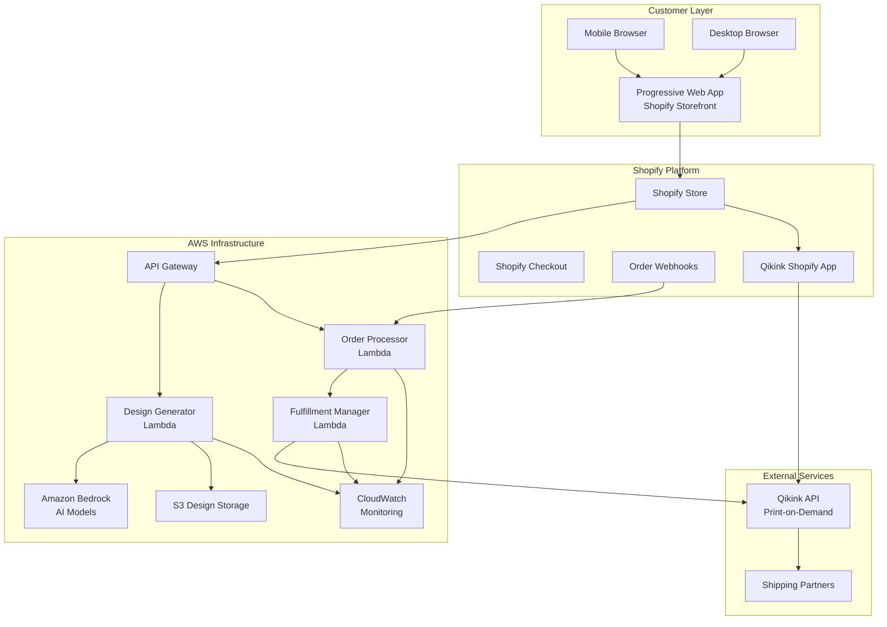

# Design Document: AI Custom Merchandise Platform

## Overview

The AI Custom Merchandise Platform is a comprehensive e-commerce solution built on Shopify that enables customers to create personalized products using AI-generated designs. The system integrates Amazon Bedrock for AI image generation, Qikink for dropshipping fulfillment, and implements a mobile-first Progressive Web App architecture.

### Core Workflow

The platform implements a 4-step customer journey:
1. **Mood Input**: Customer provides text prompt or uploads image
2. **Design Generation**: AI generates 3 design variations using Amazon Bedrock
3. **Product Selection**: Customer browses Qikink's product catalog
4. **Design Application**: Selected design is applied to chosen product via Qikink API

### Key Design Principles

- **Mobile-First**: Responsive design optimized for mobile devices (320px-428px)
- **Progressive Web App**: Installable app with offline capabilities and service worker
- **Dropshipping Model**: Zero inventory with automated Qikink integration
- **AI-Powered**: Amazon Bedrock integration for high-quality design generation
- **Performance-Focused**: Sub-3-second page loads and 60-second design generation
- **Scalable Architecture**: Serverless AWS infrastructure supporting 100+ concurrent users

## Architecture

### System Architecture



### Component Architecture

The system follows a microservices architecture with clear separation of concerns:

**Frontend Layer (Shopify Storefront)**
- Progressive Web App with service worker
- Mobile-first responsive design
- 4-step workflow implementation
- Real-time design preview
- Cart and checkout integration

**API Layer (AWS API Gateway)**
- RESTful endpoints for design generation
- Webhook processing for order events
- Authentication and rate limiting
- Request validation and routing

**Business Logic Layer (AWS Lambda)**
- Design Generator: AI integration and image processing
- Order Processor: Webhook handling and validation
- Fulfillment Manager: Qikink integration and tracking

**Data Layer**
- S3: Design storage with lifecycle policies
- Shopify: Product catalog and order management
- CloudWatch: Logging and monitoring

**Integration Layer**
- Amazon Bedrock: AI image generation
- Qikink API: Product catalog and fulfillment
- Shopify APIs: Store management and webhooks

## Components and Interfaces

### Frontend Components

#### 1. Landing Page Component
**Purpose**: Product discovery and value proposition
**Key Features**:
- Hero section with AI design examples
- Product catalog grid (t-shirts, mugs, caps, stickers)
- Pricing display with base cost + AI fee
- Login/Cart buttons in header
- Mobile-optimized navigation

**Interface**:
```typescript
interface LandingPageProps {
  products: ProductCatalog[];
  examples: DesignExample[];
  pricing: PricingInfo;
}
```

#### 2. Customization Workflow Component
**Purpose**: 4-step design creation process
**Key Features**:
- Step indicator (1 of 4, 2 of 4, etc.)
- Navigation breadcrumbs
- Session state preservation
- Mobile-optimized forms

**Interface**:
```typescript
interface WorkflowState {
  currentStep: 1 | 2 | 3 | 4;
  moodInput?: string;
  uploadedImage?: File;
  selectedDesign?: DesignVariation;
  selectedProduct?: ProductVariant;
  sessionId: string;
}
```

#### 3. Mood Input Component (Step 1)
**Purpose**: Capture customer mood via text or image
**Key Features**:
- Text input with 3-500 character validation
- Character counter
- Image upload with drag-and-drop
- File validation (PNG, JPEG, WebP, <10MB)
- Mobile camera integration

**Interface**:
```typescript
interface MoodInputProps {
  onTextSubmit: (prompt: string) => void;
  onImageSubmit: (file: File) => void;
  maxCharacters: 500;
  minCharacters: 3;
  supportedFormats: string[];
}
```

#### 4. Design Generation Component (Step 2)
**Purpose**: Display 3 AI-generated design variations
**Key Features**:
- Loading states with progress indicators
- 3-design grid layout
- Regeneration functionality
- Design selection interface
- Mobile-optimized image viewing

**Interface**:
```typescript
interface DesignGenerationProps {
  designs: DesignVariation[];
  isLoading: boolean;
  onRegenerate: () => void;
  onSelectDesign: (design: DesignVariation) => void;
  generationProgress?: number;
}
```

#### 5. Product Catalog Component (Step 3)
**Purpose**: Display Qikink products with variants
**Key Features**:
- Product grid with images
- Size and color variant selection
- Pricing display (base + markup)
- Availability status
- Size charts and specifications

**Interface**:
```typescript
interface ProductCatalogProps {
  products: QikinkProduct[];
  onProductSelect: (product: ProductVariant) => void;
  selectedDesign: DesignVariation;
  pricing: PricingCalculator;
}
```

#### 6. Design Preview Component (Step 4)
**Purpose**: Show design applied to selected product
**Key Features**:
- Accurate product mockup rendering
- Design positioning and scaling
- Pinch-to-zoom on mobile
- Add to cart functionality
- Back navigation options

**Interface**:
```typescript
interface DesignPreviewProps {
  design: DesignVariation;
  product: ProductVariant;
  mockupRenderer: MockupRenderer;
  onAddToCart: () => void;
  onGoBack: () => void;
}
```

### Backend Components

#### 1. Design Generator Lambda
**Purpose**: AI image generation and processing
**Responsibilities**:
- Bedrock API integration
- Prompt optimization for design generation
- Image quality validation (300 DPI)
- S3 storage with UUID naming
- Error handling and retries

**Interface**:
```typescript
interface DesignGeneratorRequest {
  input: {
    type: 'text' | 'image';
    content: string; // prompt or S3 URL
  };
  productType: string;
  sessionId: string;
  variationCount: 3;
}

interface DesignGeneratorResponse {
  designs: DesignVariation[];
  generationTime: number;
  modelUsed: string;
  s3Urls: string[];
}
```

#### 2. Order Processor Lambda
**Purpose**: Shopify webhook processing
**Responsibilities**:
- Webhook signature validation
- Order data extraction
- Design metadata validation
- Qikink order preparation
- Error handling and retries

**Interface**:
```typescript
interface OrderWebhookPayload {
  orderId: string;
  lineItems: OrderLineItem[];
  customer: CustomerInfo;
  shippingAddress: Address;
  designMetadata: DesignMetadata[];
}
```

#### 3. Fulfillment Manager Lambda
**Purpose**: Qikink integration and tracking
**Responsibilities**:
- Qikink API communication
- Order status synchronization
- Tracking information updates
- Shipping notifications
- Error handling and circuit breakers

**Interface**:
```typescript
interface QikinkOrderRequest {
  shopifyOrderId: string;
  products: QikinkProductOrder[];
  designs: DesignSpecification[];
  customer: CustomerInfo;
  shipping: ShippingInfo;
}
```

### API Interfaces

#### Design Generation API
```typescript
POST /api/generate-design
Content-Type: application/json

Request:
{
  "input": {
    "type": "text" | "image",
    "content": string
  },
  "productType": string,
  "sessionId": string
}

Response:
{
  "success": boolean,
  "data": {
    "designs": DesignVariation[],
    "sessionId": string,
    "generationTime": number
  },
  "error": ErrorResponse?
}
```

#### Image Upload API
```typescript
POST /api/upload-image
Content-Type: multipart/form-data

Request:
FormData with image file

Response:
{
  "success": boolean,
  "data": {
    "imageUrl": string,
    "imageId": string,
    "metadata": ImageMetadata
  }
}
```

#### Qikink Integration API
```typescript
POST /api/apply-design
Content-Type: application/json

Request:
{
  "designId": string,
  "productSku": string,
  "specifications": DesignSpecification
}

Response:
{
  "success": boolean,
  "data": {
    "qikinkProductId": string,
    "previewUrl": string,
    "printSpecifications": PrintSpecs
  }
}
```

### External Service Interfaces

#### Amazon Bedrock Integration
```typescript
interface BedrockRequest {
  modelId: string;
  body: {
    prompt: string;
    cfg_scale: number;
    steps: number;
    seed?: number;
    width: number;
    height: number;
  };
}

interface BedrockResponse {
  images: string[]; // base64 encoded
  metadata: {
    model: string;
    parameters: object;
    contentFiltered: boolean;
  };
}
```

#### Qikink API Integration
```typescript
interface QikinkProduct {
  sku: string;
  name: string;
  category: string;
  variants: ProductVariant[];
  printAreas: PrintArea[];
  pricing: PricingTier[];
  availability: boolean;
}

interface QikinkOrderCreate {
  products: {
    sku: string;
    quantity: number;
    customization: {
      designUrl: string;
      printArea: string;
      position: PrintPosition;
    };
  }[];
  shipping: ShippingDetails;
  customer: CustomerDetails;
}
```

## Data Models

### Core Data Models

#### Design Variation
```typescript
interface DesignVariation {
  id: string; // UUID
  s3Url: string;
  thumbnailUrl: string;
  metadata: {
    prompt?: string;
    sourceImageUrl?: string;
    model: string;
    parameters: BedrockParameters;
    generatedAt: Date;
    dimensions: {
      width: number;
      height: number;
      dpi: number;
    };
  };
  status: 'generating' | 'ready' | 'failed';
  sessionId: string;
}
```

#### Product Variant
```typescript
interface ProductVariant {
  sku: string;
  productType: 'tshirt' | 'polo' | 'mug' | 'cap' | 'sticker';
  name: string;
  basePrice: number;
  variants: {
    size?: string;
    color: string;
    colorHex: string;
  };
  printArea: {
    width: number; // inches
    height: number; // inches
    position: 'front' | 'back' | 'full';
  };
  mockupImages: {
    front: string;
    back?: string;
    side?: string;
  };
  availability: boolean;
  estimatedDelivery: string; // "2-5 business days"
}
```

#### Order Metadata
```typescript
interface OrderMetadata {
  shopifyOrderId: string;
  lineItems: {
    lineItemId: string;
    productSku: string;
    designId: string;
    designUrl: string;
    customization: {
      printArea: string;
      position: PrintPosition;
      specifications: DesignSpecification;
    };
  }[];
  customer: {
    id: string;
    email: string;
    phone?: string;
  };
  fulfillment: {
    qikinkOrderId?: string;
    status: FulfillmentStatus;
    trackingNumber?: string;
    estimatedDelivery?: Date;
  };
  createdAt: Date;
  updatedAt: Date;
}
```

#### Session State
```typescript
interface SessionState {
  sessionId: string;
  currentStep: 1 | 2 | 3 | 4;
  data: {
    moodInput?: {
      type: 'text' | 'image';
      content: string;
      timestamp: Date;
    };
    generatedDesigns?: DesignVariation[];
    selectedDesign?: DesignVariation;
    selectedProduct?: ProductVariant;
    cartData?: {
      itemId: string;
      quantity: number;
      customization: object;
    };
  };
  expiresAt: Date;
  createdAt: Date;
}
```

### Database Schema (Shopify Metafields)

#### Product Metafields
```typescript
interface ProductMetafields {
  'custom.qikink_sku': string;
  'custom.print_areas': string; // JSON
  'custom.base_price': number;
  'custom.ai_design_fee': number;
  'custom.availability': boolean;
  'custom.size_chart': string; // JSON
}
```

#### Order Metafields
```typescript
interface OrderMetafields {
  'custom.design_urls': string; // JSON array
  'custom.design_specifications': string; // JSON
  'custom.qikink_order_id': string;
  'custom.fulfillment_status': string;
  'custom.generation_metadata': string; // JSON
}
```

#### Customer Metafields
```typescript
interface CustomerMetafields {
  'custom.design_history': string; // JSON array of design IDs
  'custom.generation_count': number;
  'custom.last_generation': string; // ISO date
}
```

### S3 Storage Structure

```
custom-designs-bucket/
├── designs/
│   ├── {uuid}.png          # Generated designs
│   ├── {uuid}_thumb.png    # Thumbnails
│   └── metadata/
│       └── {uuid}.json     # Design metadata
├── uploads/
│   ├── {uuid}.{ext}        # Customer uploads
│   └── processed/
│       └── {uuid}.png      # Processed uploads
├── mockups/
│   ├── products/
│   │   ├── tshirt/
│   │   ├── mug/
│   │   └── cap/
│   └── generated/
│       └── {design-id}_{product-sku}.png
└── cache/
    └── frequent-designs/    # Cached popular designs
```

### Configuration Models

#### Bedrock Configuration
```typescript
interface BedrockConfig {
  models: {
    primary: {
      modelId: string;
      parameters: BedrockParameters;
      costPerImage: number;
    };
    fallback: {
      modelId: string;
      parameters: BedrockParameters;
    };
  };
  contentFilters: {
    enabled: boolean;
    strictness: 'low' | 'medium' | 'high';
  };
  rateLimits: {
    perCustomer: number; // per hour
    global: number; // per minute
  };
}
```

#### Qikink Configuration
```typescript
interface QikinkConfig {
  api: {
    baseUrl: string;
    credentials: {
      apiKey: string;
      secretKey: string;
    };
    timeout: number;
    retryAttempts: number;
  };
  products: {
    syncInterval: number; // hours
    categories: string[];
    markup: {
      percentage: number;
      fixedAmount: number;
    };
  };
  fulfillment: {
    processingTime: string; // "1-2 business days"
    shippingTime: string; // "2-5 business days"
    trackingEnabled: boolean;
  };
}
```
